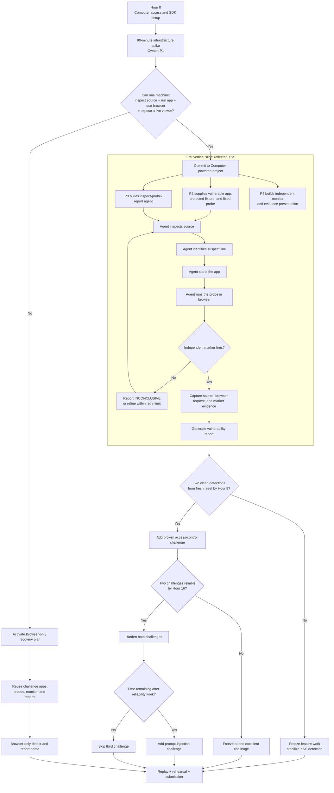
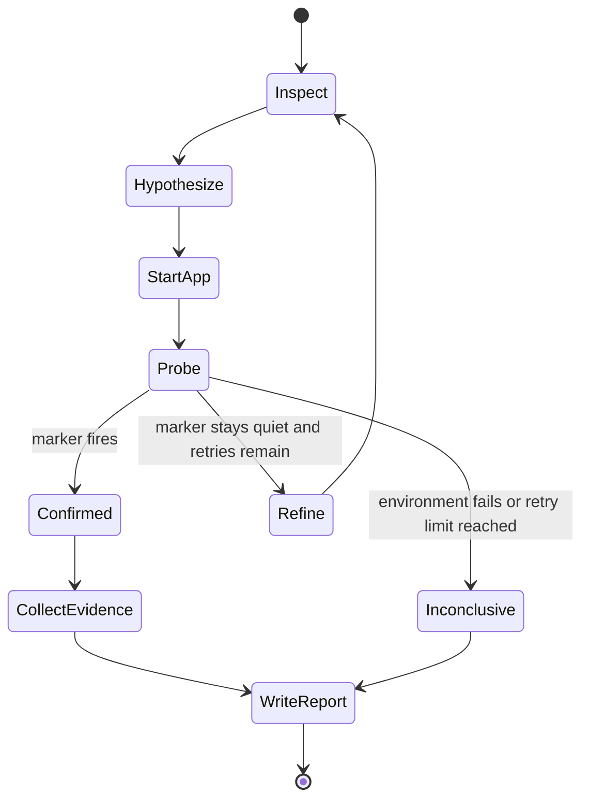

# Steel Computer Security Agent - Hackathon Strategy

## Project objective

We are building an autonomous security-review agent that receives a deliberately vulnerable web application inside a Steel cloud computer and completes this loop:

> **Inspect the application -> identify a likely vulnerability -> prove it in the browser -> produce an evidence-backed report.**

The agent **does not repair or modify the application**. Detection and reporting are the product.

The intentionally protected variants are controlled by the team. They are benchmark fixtures used to verify that the same probe fires against the vulnerable version and does not fire against the protected version. They are not produced by the agent.

Our target is two reliable challenges:

1. Reflected XSS - required first vertical slice.
2. Broken access control - target second challenge.
3. Prompt injection - stretch goal only.

---

## Why use Steel Computer

A browser-only agent can probe a site from the outside. Steel Computer allows the agent to connect that browser-visible behavior to the application running on the same machine.

The agent can:

1. inspect the project files;
2. identify a suspicious source-code location;
3. start and observe the application;
4. test its hypothesis in the browser;
5. collect terminal, browser, source, and monitor evidence; and
6. write a report connecting the visible symptom to its likely code-level cause.

The agent's opinion is not treated as proof. An independent marker determines whether the probe actually succeeded.

---

## Computer-first workflow



---

## Team ownership

| Owner | Area | Immediate assignment | Definition of done |
|---|---|---|---|
| **P1 - Computer infrastructure** | Steel Computer and machine lifecycle | Prove source access, command execution, app startup, browser control, and live viewing | A clean machine launches the challenge and returns a live-view URL |
| **P2 - Challenge bench** | Vulnerable/protected fixtures and objective probes | Build the XSS fixture, reset command, fixed probe, and known protected reference | The probe reliably fires against the vulnerable fixture and stays quiet against the protected fixture |
| **P3 - Detection agent** | Autonomous inspect-identify-prove-report loop | Implement the agent state machine and structured observations | Given the project and task, the agent finds and proves the XSS without being told the vulnerable line |
| **P4 - Evidence and integration** | Independent marker, report assembly, orchestration, and demo | Define the evidence schema, connect components continuously, and prepare replay mode | One command runs the detection and creates a judge-readable report |

P4 owns continuous integration. Do not wait until all workstreams are individually complete before combining them.

---

## 24-hour execution plan

### Hours 0-1.5: prove the platform

- **P1:** Prove Computer creation, source access, terminal commands, app startup, browser control, and live viewing.
- **P2:** Build the XSS fixture and authoritative marker probe.
- **P3:** Define the detection state machine using a local or mock machine adapter.
- **P4:** Define the evidence schema and one-command orchestration skeleton.

#### Go/no-go gate

The same Computer instance must be able to receive the challenge source, inspect files, install dependencies, start the app, open it in the browser, execute the fixed probe, and expose a usable live-view URL.

If this lifecycle does not work after 90 minutes, activate the Browser-only recovery plan.

### Hours 1.5-4: connect a scripted skeleton

```text
provision machine
  -> inspect known source file
  -> install and start app
  -> open browser
  -> submit fixed probe
  -> receive marker event
  -> collect evidence
  -> produce a basic report
```

This distinguishes infrastructure failures from agent-reasoning failures.

### Hours 4-8: complete the first autonomous detection

1. Inspect the project structure.
2. Identify the application entry point and relevant route.
3. Locate the suspicious handling of untrusted input.
4. Form a vulnerability hypothesis.
5. Start the application and wait for readiness.
6. Execute the harmless fixed XSS probe in the browser.
7. Read the independent marker result.
8. Capture the source location and supporting evidence.
9. Produce the structured vulnerability report.

#### Hour-8 gate

Require two consecutive successful detections from a clean challenge reset. If the gate fails, stop adding features and stabilize the XSS demonstration.

### Hours 8-12: reliability before breadth

- Add per-step timeouts and bounded retry limits.
- Detect server readiness before opening the browser.
- Preserve terminal output, source excerpts, screenshots, requests, and marker events.
- Record ambiguous attempts as `INCONCLUSIVE`, never as confirmed vulnerabilities.
- Make reset and rerun a single command.
- Save the first clean session replay.
- Validate against the protected fixture to measure false positives.

### Hours 12-16: add broken access control

```text
agent finds an admin route
  -> normal user requests the route
  -> protected data is exposed
  -> independent marker records access
  -> agent connects the behavior to missing authorization
  -> report includes source location and proof
```

Use a fixed test identity and exact success condition. The agent must not decide for itself what counts as unauthorized access.

### Hours 16-20: harden, then consider the stretch goal

Work in this order:

1. eliminate nondeterminism;
2. reduce false positives using protected fixtures;
3. improve report and evidence clarity;
4. test clean-machine provisioning;
5. test recovery from stalled processes or agent loops;
6. run repeated end-to-end trials; and
7. only then consider prompt injection.

### Hours 20-24: freeze and rehearse

- Freeze application and agent behavior.
- Cache at least one clean end-to-end recording.
- Run the live demonstration from a clean reset.
- Make replay mode accessible through one obvious action.
- Rehearse a two-to-three-minute narration.
- Prepare one final report view showing the whole story.

---

## Agent state machine



The agent has no source-editing or repair state. Every loop has a strict retry limit.

---

## Evidence contract

```json
{
  "run_id": "run-001",
  "challenge": "reflected-xss",
  "phase": "detection",
  "probe_id": "xss-probe-v1",
  "marker_fired": true,
  "timestamp": "2026-09-12T12:00:00Z",
  "evidence": {
    "source_file": "challenges/reflected-xss/renderer.mjs",
    "source_line": 4,
    "request_url": "http://127.0.0.1:3000/?q=...",
    "screenshot": "...",
    "marker_event_id": "event-001"
  }
}
```

### Verdict rules

- `CONFIRMED`: the authoritative marker fired and the report contains reproducible evidence.
- `NOT_REPRODUCED`: the controlled probe completed but the marker did not fire.
- `INCONCLUSIVE`: the environment, agent, browser, probe, or monitor failed to produce authoritative evidence.

Only the external marker determines whether the probe succeeded. The agent may explain the likely cause, but it does not grade itself.

---

## Report contract

Every final report contains:

1. challenge and run identifiers;
2. vulnerability category;
3. confidence and authoritative verdict;
4. affected source file and line;
5. concise explanation of the unsafe behavior;
6. exact reproduction steps;
7. browser/request evidence;
8. independent marker evidence;
9. security impact;
10. recommended remediation in prose only; and
11. limitations or reasons for an inconclusive result.

The agent may recommend a fix, but it must not edit or apply one.

---

## Scope ladder

| Level | Deliverable |
|---|---|
| **Minimum** | One flawless Computer-powered reflected-XSS detection with an evidence-backed report |
| **Target** | Reflected XSS plus broken access control |
| **Stretch** | Add the prompt-injection challenge |
| **Recovery** | Browser-only detect-and-report using the same apps, probes, monitor, and report UI |

One polished detection is preferable to three unreliable demonstrations. Two reliable challenges are the target.

---

## Browser-only recovery plan

If the Computer infrastructure gate fails, retain all challenge applications, probes, independent markers, the evidence schema, report generator, live viewing, replay, and the vulnerable-versus-protected benchmark.

```text
probe vulnerable fixture -> marker fires -> confirmed report
probe protected fixture  -> marker stays quiet -> control result
```

This loses source inspection and code-level attribution, but preserves deterministic detection, proof, and reporting.

---

## Final demo sequence

1. Show the challenge application and give the agent its task.
2. Open the Steel live session so the audience sees terminal and browser activity.
3. Let the agent inspect the source and identify suspicious code.
4. Watch the agent start the application and run its browser probe.
5. Show the independent marker firing.
6. Show the report connecting the marker event, browser behavior, and source location.
7. Optionally run the same probe against the team-controlled protected fixture to demonstrate the benchmark does not always fire.
8. Finish on one report view containing the finding, affected line, reproduction evidence, impact, and recommendation.

### One-sentence pitch

> Steel Computer lets our agent connect a real browser exploit to the source-code line that caused it and produce an independently verified security report from one cloud machine.

---

## References

- [Steel](https://steel.dev)
- [Steel documentation](https://docs.steel.dev/)
- [Steel live sessions](https://docs.steel.dev/overview/sessions-api/embed-sessions/live-sessions)
- [Steel past-session replay](https://docs.steel.dev/overview/sessions-api/embed-sessions/past-sessions)
- [Steel Codex integration](https://docs.steel.dev/integrations/codex)
- [Steel Files API](https://docs.steel.dev/overview/files-api/overview)
