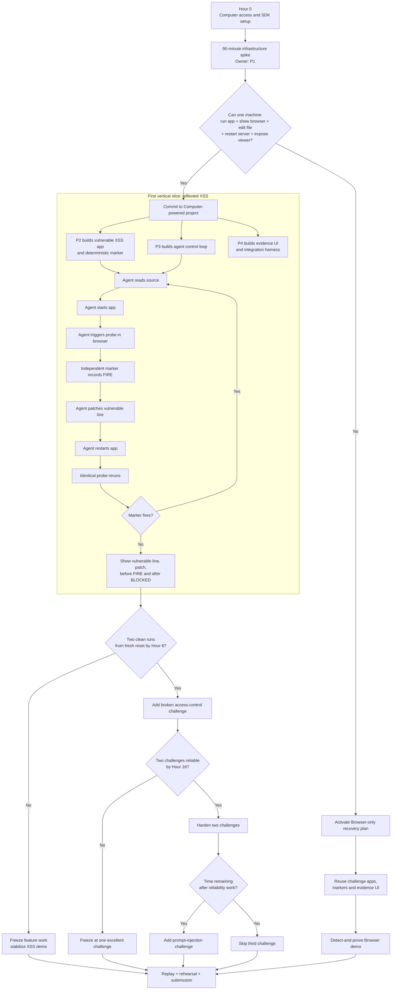
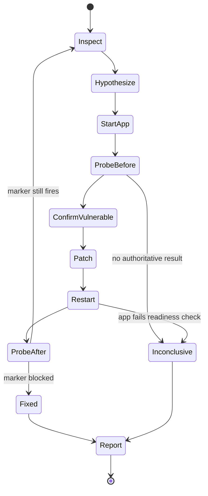

# Steel Computer Security Agent — Hackathon Strategy

## TL;DR

We are building a security agent that receives a deliberately vulnerable web application inside a Steel cloud computer and completes the full engineering loop:

> **Find the bug → prove it in the browser → patch the source → restart the application → repeat the same probe → prove the fix.**

We will pursue the Computer-powered version immediately. The first 90 minutes are a strict infrastructure gate: Steel Computer must support the exact terminal, filesystem, process, browser, and live-view lifecycle the demo requires. If that gate fails, the challenge apps, probes, evidence system, and dashboard become a Browser-only detect-and-prove fallback.

Our target is **two reliable challenges**, not three fragile ones:

1. Reflected XSS — required first vertical slice.
2. Broken access control — target second challenge.
3. Prompt injection — stretch goal only.

---

## Why this needs Steel Computer

A browser-only agent can test a site from the outside, but it cannot connect a visible symptom to its source-code cause. Steel Computer gives the agent the browser, terminal, filesystem, and running processes in one environment.

That lets the agent:

1. inspect the source;
2. start the application;
3. trigger the suspected weakness in the browser;
4. edit the vulnerable code;
5. restart the server; and
6. repeat the identical probe to verify the fix.

The repeated probe—not the agent's own claim—is the judge. An independent marker determines whether the vulnerability fired before and after the patch.

---

## Strategy



---

## Team ownership

| Owner | Area | Immediate assignment | Definition of done |
|---|---|---|---|
| **P1 — Computer infrastructure** | Steel Computer, machine lifecycle, and tool execution | Complete the 90-minute spike; expose controlled read, write, command, restart, and browser operations | A script provisions a clean machine, launches the app, and returns its live-view URL |
| **P2 — Challenge bench** | Vulnerable applications and objective probes | Build the XSS vulnerable state, reset fixture, expected patch behavior, and marker endpoint | A scripted probe reliably fires before the fix and stays quiet after it |
| **P3 — Agent loop** | Autonomous find–prove–fix–verify behavior | Implement the agent state machine and structured action log | Given only the task and project, the agent completes the XSS loop without being told the vulnerable line |
| **P4 — Integration and evidence** | Dashboard, orchestration, reliability, and demo operations | Define the shared event schema, connect components continuously, and prepare replay mode | One command launches a run and produces a judge-readable evidence record |

### Integration rule

P4 is the integration owner, not just the presentation owner. Integration happens continuously; it does not wait for the other three workstreams to finish.

All components must use shared interfaces so the same challenge bench and evidence UI survive a switch to Browser-only mode.

---

## 24-hour execution plan

### Hours 0–1.5: prove the platform

P1 runs the infrastructure spike while everyone else begins work that is useful in either mode.

- **P1:** Prove Computer creation, terminal commands, file access, process management, browser control, and live viewing.
- **P2:** Build the XSS app and independent marker endpoint.
- **P3:** Define the agent state machine using a local or mock machine adapter.
- **P4:** Define the evidence schema and create a one-command orchestration skeleton.

#### Go/no-go gate

The same Computer instance must be able to:

- receive or clone the application source;
- install dependencies;
- start the application server;
- open the application in its browser;
- edit a source file;
- restart the server;
- repeat the browser probe; and
- expose a usable live-view URL.

If this lifecycle does not work after **90 minutes**, activate the Browser-only recovery plan. Do not let preview-SDK debugging consume the hackathon.

### Hours 1.5–4: connect the mechanical skeleton

Before adding agent autonomy, prove the lifecycle with a scripted edit:

```text
provision machine
  → install and start app
  → open browser
  → submit probe
  → receive marker
  → edit known file
  → restart app
  → repeat identical probe
  → save evidence
```

This distinguishes infrastructure failures from agent-reasoning failures.

### Hours 4–8: complete the first autonomous repair

Replace the scripted edit with the agent loop:

1. Inspect the project files and identify the application entry point.
2. Read the relevant server or route code.
3. Form a vulnerability hypothesis.
4. Start the application and wait for readiness.
5. Trigger the harmless XSS marker in the browser.
6. Patch the vulnerable output handling.
7. Restart the server.
8. Repeat the exact same probe.
9. Produce the source diff and structured evidence record.

#### Hour-8 gate

Require **two consecutive successful runs from a clean challenge reset**.

- If the gate passes, proceed to the second challenge.
- If it fails, stop feature work and stabilize the XSS demonstration.

### Hours 8–12: reliability before breadth

- Add explicit per-step timeouts and bounded retry limits.
- Detect server readiness before opening the browser.
- Preserve terminal output, screenshots, marker events, and source diffs.
- Record failed or ambiguous runs as `INCONCLUSIVE`, never `FIXED`.
- Make reset and rerun a single command.
- Save the first clean session replay.
- Test failure handling for a stalled agent and a failed server restart.

### Hours 12–16: add broken access control

Reuse the same harness for the second challenge:

```text
normal user requests /admin
  → protected data is exposed
  → independent marker records the access
  → agent locates authorization logic
  → agent patches and restarts the app
  → same user repeats the same request
  → access is denied
```

Use a fixed test identity and an exact expected response. The agent must not create its own test user or decide for itself what “denied” means.

#### Hour-16 gate

- If two challenges run reliably, freeze their behavior and harden them.
- If they do not, freeze the strongest challenge and concentrate on making it excellent.

### Hours 16–20: harden, then consider the stretch goal

Work in this order:

1. eliminate nondeterminism;
2. improve evidence clarity;
3. test clean-machine provisioning;
4. test recovery from stalled processes or agent loops;
5. run repeated end-to-end trials; and
6. only then consider prompt injection.

Prompt injection is optional because its success criteria can become ambiguous. If included, its marker must detect one specific prohibited action—not merely whether the agent mentioned or repeated injected text.

### Hours 20–24: freeze and rehearse

- Freeze application and agent behavior.
- Cache at least one clean end-to-end recording.
- Run the live demonstration from a clean reset.
- Make replay mode accessible through one obvious action.
- Rehearse a two-to-three-minute narration.
- Prepare one final evidence frame showing the whole story.

---

## Agent state machine



Each transition must emit a structured event. Every loop must have a retry limit so the demo cannot stall indefinitely.

---

## Evidence contract

Each challenge should produce the same result shape:

```json
{
  "run_id": "run-001",
  "challenge": "reflected-xss",
  "status": "fixed",
  "before": {
    "probe_id": "xss-probe-v1",
    "marker_fired": true,
    "evidence": []
  },
  "patch": {
    "file": "app/server.ts",
    "diff": ""
  },
  "after": {
    "probe_id": "xss-probe-v1",
    "marker_fired": false,
    "evidence": []
  },
  "timestamps": {
    "started_at": "",
    "completed_at": ""
  }
}
```

### Result rules

- `FIXED`: the marker fired before the patch and the identical probe was blocked afterward.
- `VULNERABLE`: the marker fired and no verified repair was completed.
- `INCONCLUSIVE`: the environment, agent, probe, or monitor failed to produce authoritative evidence.

Only the external marker may determine whether the vulnerability fired. The agent supplies the hypothesis, patch, and explanation, but it does not grade its own work.

---

## Scope ladder

| Level | Deliverable |
|---|---|
| **Minimum** | One flawless Computer-powered reflected-XSS repair with live evidence |
| **Target** | Reflected XSS plus broken access control |
| **Stretch** | Add the prompt-injection challenge |
| **Recovery** | Browser-only detect-and-prove using the same apps, markers, and dashboard |

One polished end-to-end repair is preferable to three unreliable demonstrations. Two reliable challenges are the target.

---

## Browser-only recovery plan

If the Computer infrastructure gate fails, retain:

- all planted challenge applications;
- the probes and independent markers;
- the evidence schema;
- the dashboard and scorecard;
- Steel live viewing and session replay; and
- the vulnerable-versus-protected comparison.

The fallback flow becomes:

```text
probe vulnerable version → marker fires
probe protected version  → marker stays quiet
show request, response, marker evidence, and replay
```

This loses autonomous patching, but still provides a deterministic detect-and-prove demonstration without restarting the project from zero.

---

## Final demo sequence

1. Show the vulnerable application and give the agent its task.
2. Open the Steel live session so the audience sees the terminal and browser activity.
3. Let the agent inspect the source and identify the suspect code.
4. Watch the agent start the app and trigger the probe.
5. Show the independent marker turning red.
6. Watch the agent patch the code and restart the server.
7. Repeat the exact same probe.
8. Show the marker staying green.
9. Finish on a single frame containing:
   - the vulnerable line;
   - the patched line;
   - the before-probe result;
   - the after-probe result; and
   - the final verdict.

### One-sentence pitch

> Steel Computer lets our agent connect a visible browser exploit to the source-code line that caused it, repair that line, and prove the repair by rerunning the identical probe—all on one cloud machine.

---

## References

- [Steel](https://steel.dev)
- [Steel documentation](https://docs.steel.dev/)
- [Steel live sessions](https://docs.steel.dev/overview/sessions-api/embed-sessions/live-sessions)
- [Steel past-session replay](https://docs.steel.dev/overview/sessions-api/embed-sessions/past-sessions)
- [Steel Codex integration](https://docs.steel.dev/integrations/codex)
- [Steel Files API](https://docs.steel.dev/overview/files-api/overview)

